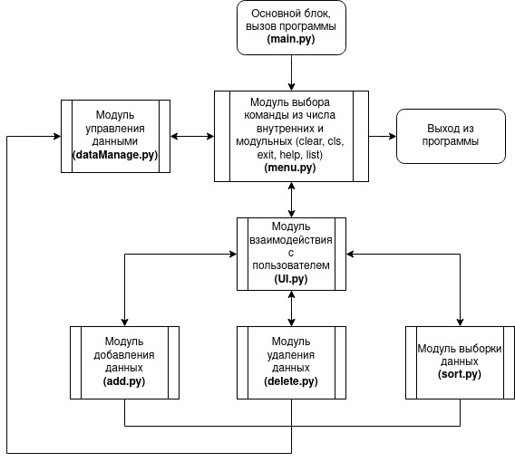
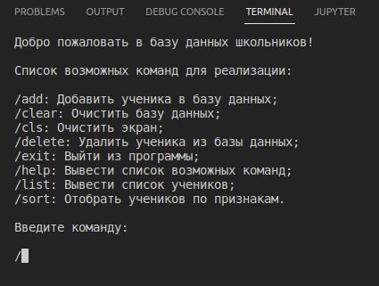
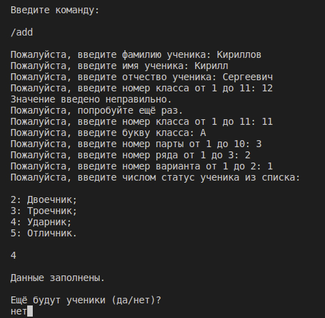
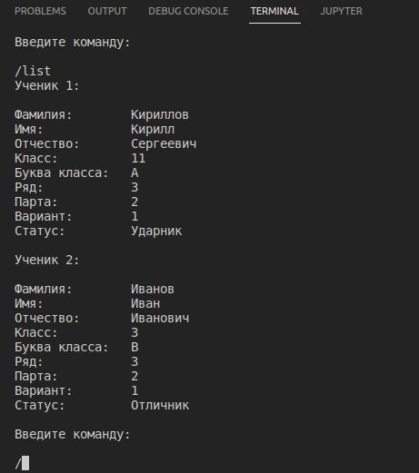
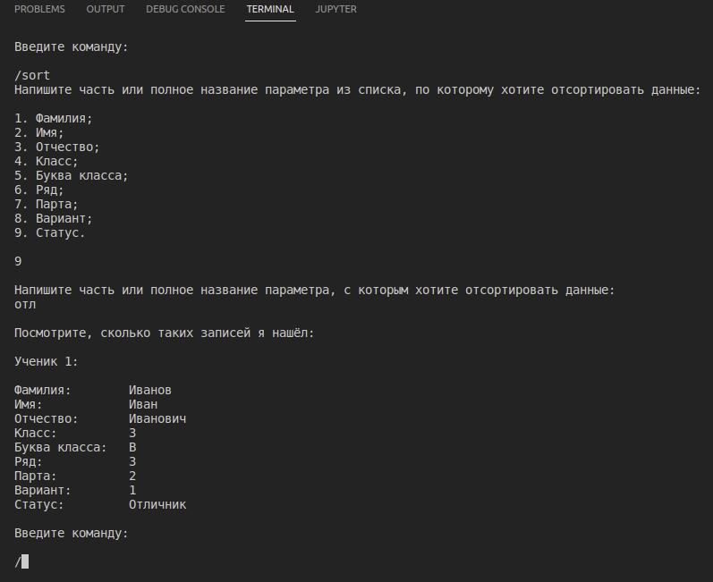
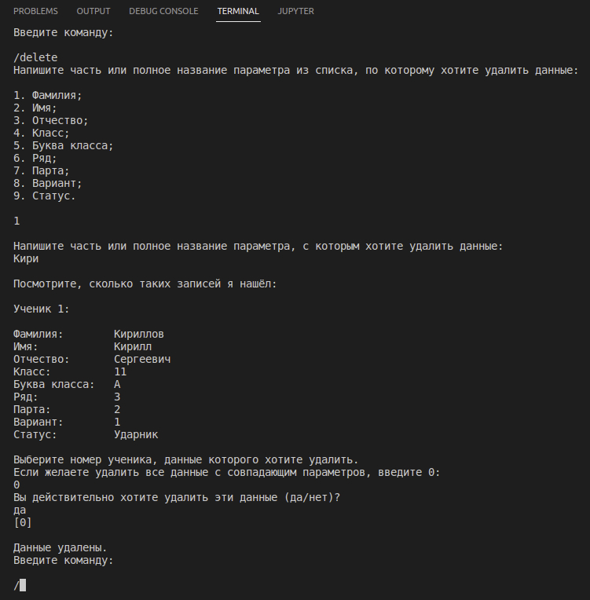

# **Программа для ведения базы данных (БД) школьников с внешним хранилищем**
## **Архитектура программы:**


Программа работает по модульному принципу, где из одного модуля вытекает другой, а иногда происходит взаимодействие модулей для вывода информации пользователю на экран (модуль **UI.py**)
## **Описание работы программы:**
1. При запуске программы пользователю необходимо выбрать команду, соответствующей её описанию:



```
P.S.: Если ввести несуществующую команду, программа выдаст предупреждение.
```

2. При вводе команды добавления ученика (**/add**), пользователю необходимо последовательно вводить данные по инструкциям. После ввода данных ученика программа спрашивает, есть ли еще ученик, которого необходимо добавить. Если да, то вводятся новые ученики.



```
P.S.: 1. При вводе неверных значений в любом из модулей программа выдаст предупреждение; 2. Если оставлять поля пустыми, система посчитает, что ученика нет и не будет добавлять его в БД.
```

3. При вводе команды вывода списка учеников (**/list**) в консоль выводятся все ученики, находящиеся в БД:



```
P.S.: Если в БД ничего нет, то выводится сообщение, что БД пуста.
```

4. При вводе команд очистки БД (**/clear**), очистки экрана консоли (**/cls**), выхода из программы (**/exit**), вывода списка возможных команд (**/help**) выполняются соответствующие действия.

5. При вводе команды выборки данных (**/sort**), пользователю необходимо сначала ввести номер параметра из списка, по которому он хочет выделить учеников. После этого нужно ввести часть или полное название параметра, с которым он хочет отсортировать данные, после чего программа выдаст список подходящих под критерий учеников:



6. Команда удаления данных (**/delete**) аналогична предыдущей. Дополнительно пользователю нужно будет выбрать из выпадающего списка номер ученика, который он хочет удалить, либо удалить всех учеников сразу с подходящим параметром с соответствующим подтверждением:



```
P.S.: В командах **/sort** и **/delete** если подходящего ничего нет, то выводится соответствующее сообщение.
```

**Над приложением работал Кириллов Кирилл.**